# The AncesTree guide

AncesTree keeps your family's tree on your own computer: everyone in it, how they're related, their photos and their life stories. It answers "how are these two related?" in English, Malay or Javanese, and shows the family as a tree, on a timeline and on a map.

Each relative who joins has the same family on their own computer. A private folder in Google Drive keeps every computer in step. One person, **the keeper**, looks after the family's record. The keeper looks at every change a relative makes before it reaches everyone else.

**Who this guide is for:** everyone in the family, on Windows or a Mac. Start at the beginning. Parts marked **For the keeper** are only for the person who keeps the family.

## Contents

**Part 1: Get started**

1. [Words used in this guide](#1-words-used-in-this-guide)
2. [Install AncesTree](#2-install-ancestree): [on Windows](#on-windows), [on a Mac](#on-a-mac)
3. [The first start](#3-the-first-start)
4. [Opening and closing AncesTree](#4-opening-and-closing-ancestree)

**Part 2: Use AncesTree**

5. [A tour of the window](#5-a-tour-of-the-window)
6. [The tree](#6-the-tree)
7. [Looking at someone](#7-looking-at-someone)
8. [Adding and changing people](#8-adding-and-changing-people)
9. [Life stories](#9-life-stories)
10. [How are two people related?](#10-how-are-two-people-related)
11. [Me: telling AncesTree who you are](#11-me-telling-ancestree-who-you-are)
12. [The timeline](#12-the-timeline)
13. [The map](#13-the-map)
14. [Family facts, and what's missing](#14-family-facts-and-whats-missing)
15. [Kinship words and the dictionary](#15-kinship-words-and-the-dictionary)
16. [Copies for phones, and other files](#16-copies-for-phones-and-other-files)
17. [Bringing people in from a spreadsheet](#17-bringing-people-in-from-a-spreadsheet)

**Part 3: The family folder**

18. [For relatives: join your family](#18-for-relatives-join-your-family)
19. [For the keeper: start and look after the family folder](#19-for-the-keeper-start-and-look-after-the-family-folder)

**Part 4: Look after AncesTree**

20. [Backups](#20-backups)
21. [Updates](#21-updates)
22. [Keep your computer safe](#22-keep-your-computer-safe)
23. [Where AncesTree keeps the family](#23-where-ancestree-keeps-the-family)
24. [When something goes wrong](#24-when-something-goes-wrong)
25. [Removing AncesTree](#25-removing-ancestree)
26. [Linux](#26-linux)

---

# Part 1: Get started

## 1. Words used in this guide

| Word | What it means |
|---|---|
| **Click** | Press the left mouse button once, or tap a laptop's touchpad once. |
| **Double-click** | Click twice, quickly. |
| **Right-click** | Press the right mouse button. On a Mac, hold **Control** and click. |
| **Drag** | Press and hold the mouse button on something, move the mouse, then let go. |
| **The window** | AncesTree's own window on your screen, with the family in it. |
| **The icon by the clock** | AncesTree's small icon: a green square with a little family tree on it. On Windows it's at the bottom right, by the clock. On a Mac it's at the top right, in the menu bar. |
| **The keeper** | The one person who looks after the family's record. |
| **Ctrl** | The key marked **Ctrl** on Windows. On a Mac, use **⌘ Command** wherever this guide says **Ctrl**. |

## 2. Install AncesTree

**You need:**

- **a Windows computer** with Windows 10 or 11, **or a Mac** with Apple Silicon (an M1 chip or newer) and macOS 11 or newer;
- **the internet**, the first time AncesTree starts. It fetches about 330 MB once;
- **a Google account**, to join your family. Tell your keeper which one it is.

Phones and tablets can't install AncesTree. Your keeper can send you a copy to look at instead (see [Copies for phones](#16-copies-for-phones-and-other-files)).

**Download AncesTree:**

1. Open the [latest release of AncesTree](https://github.com/khilfi/ancestree/releases/latest) in your web browser.
2. Scroll down to **Assets**.
3. Click the file for your computer:

| Your computer | The file to click |
|---|---|
| Windows | `AncesTree_<version>_x64-setup.exe` |
| Mac | `AncesTree_<version>_aarch64.dmg` |

It goes to your **Downloads** folder.

**Why your computer warns you.** AncesTree is made for one family. It doesn't carry the paid signature that big companies' programs carry, so Windows and the Mac warn you about it, once, while you install it. The steps below show each warning and what to choose. After that, AncesTree updates itself, and only ever installs updates signed by its maintainer.

### On Windows

1. **Open the file you downloaded.** Open your **Downloads** folder and double-click `AncesTree_<version>_x64-setup.exe`.
2. **Windows says "Windows protected your PC".** Click **More info**.
   <!-- picture: guide/windows-1-protected.png (Windows protected your PC) -->
3. **Click Run anyway.**
   <!-- picture: guide/windows-2-run-anyway.png (the same, with Run anyway) -->
4. **The installer opens.** Click **Next**, then **Install**. It installs AncesTree for you alone, so it doesn't ask for an administrator's password.
   <!-- picture: guide/windows-3-installer.png (the installer's first page) -->
5. **At the end,** keep **Run AncesTree** ticked, and click **Finish**. Tick **Create desktop shortcut** too if you'd like an icon on your desktop.
   <!-- picture: guide/windows-4-finish.png (the last page, Run AncesTree ticked) -->

**If Windows says Smart App Control blocked it,** and there's no **Run anyway**: Smart App Control is switched on. It lets in only programs with the paid signature. To install AncesTree, switch it off:

1. Click **Start**, type **Smart App Control**, and open **Smart App Control settings**.
2. Choose **Off**.
   <!-- picture: guide/windows-5-smart-app-control.png (Smart App Control settings) -->
3. Open the installer again.

Switching it off is your choice. Windows may not let you switch it back on without setting up Windows again. Microsoft Defender keeps protecting your computer either way.

### On a Mac

1. **Open the file you downloaded.** Open your **Downloads** folder and double-click `AncesTree_<version>_aarch64.dmg`.
2. **Drag AncesTree onto the Applications folder** in the window that opens.
   <!-- picture: guide/mac-1-drag-to-applications.png (the disk image's window) -->
3. **Open AncesTree** from your **Applications** folder. Your Mac says it couldn't check that AncesTree is safe, and doesn't open it. Click **Done**. Don't click **Move to Trash**.
   <!-- picture: guide/mac-2-not-opened.png (the Mac's message, with Done) -->
4. **Open System Settings**, then **Privacy & Security**. Scroll down to **Security**, where it says AncesTree was blocked. Click **Open Anyway**.
   <!-- picture: guide/mac-3-open-anyway.png (Privacy & Security, with Open Anyway) -->
5. **Your Mac asks once more.** Click **Open Anyway**, then type your Mac's password, or use Touch ID.
   <!-- picture: guide/mac-4-open-anyway-again.png (the Mac asking once more) -->

From then on, AncesTree opens like any other app.

## 3. The first start

The first time AncesTree starts, it fetches the database it keeps the family in, and the Java that database runs on. That's about 330 MB, checked before it's used. The window says how far it has got. This happens only once, and takes a minute or two on a good connection.

<!-- picture: guide/first-start.png (the window while it fetches its database) -->

After that, AncesTree opens in a few seconds.

**On a new computer, AncesTree first asks about your family:**

> Welcome to AncesTree. Does your family keep its AncesTree in a family folder? Join it, or start your family's own.

- **A relative** chooses **Join or start**, then follows [Join your family](#18-for-relatives-join-your-family).
- **The keeper** follows [For the keeper](#19-for-the-keeper-start-and-look-after-the-family-folder).
- To look around first, choose **Not now**. You can join later from **Settings → Family folder**.

## 4. Opening and closing AncesTree

**AncesTree starts by itself** when you sign in to your computer, without opening its window. It keeps your family in step in the background while it runs.

**Its icon is by the clock.** On Windows, it's at the bottom right; if you can't see it, click the small **^** arrow beside the clock. On a Mac, it's in the menu bar at the top right.

<!-- picture: guide/tray-menu.png (the icon's menu) -->

**To open the window:** click the icon. Or right-click the icon and choose **Open AncesTree**. On a Mac, you can also click AncesTree in the Dock.

**Closing the window doesn't stop AncesTree.** It keeps running by the clock. This is on purpose: it keeps the family in step while it runs.

**The icon's menu** (right-click the icon):

| Choice | What it does |
|---|---|
| **Open AncesTree** | Opens the window. |
| **Start when I sign in** | Ticked: AncesTree starts by itself when you sign in. Click it to untick. |
| **Check for updates** | Looks for a new version now (see [Updates](#21-updates)). |
| **Quit AncesTree** | Stops AncesTree completely, until you open it again. |

**To open AncesTree after quitting it:** on Windows, click **Start** and type **AncesTree**. On a Mac, open it from **Applications**.

---

# Part 2: Use AncesTree

The pictures in this part show a made-up family, *Keluarga Contoh*. Your own family appears in their place.

## 5. A tour of the window

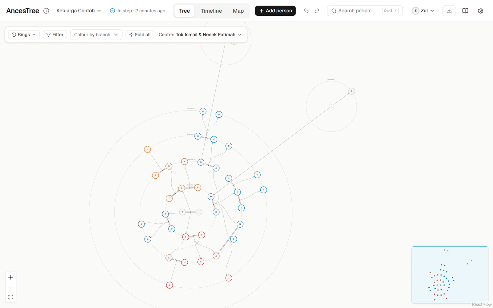

**The bar along the top:**

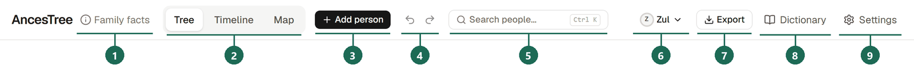

| | Name | What it does |
|---|---|---|
| 1 | **Family facts** | Facts about the whole family at a glance (see [Family facts](#14-family-facts-and-whats-missing)). |
| 2 | **Tree**, **Timeline**, **Map** | Three ways to see the family. Click one to switch. |
| 3 | **Add person** | Adds someone new (see [Adding people](#8-adding-and-changing-people)). |
| 4 | **Undo** and **Redo** | Undo takes back your last change; Redo puts it back again. Point at them to see which change. |
| 5 | **Search people…** | Finds someone by name or nickname. |
| 6 | **Me** | Tells AncesTree who you are. Once you've chosen, it shows your name (see [Me](#11-me-telling-ancestree-who-you-are)). |
| 7 | **Export** | Copies for phones, and files for other programs (see [Copies](#16-copies-for-phones-and-other-files)). |
| 8 | **Dictionary** | The words for relatives in English, Malay and Javanese. |
| 9 | **Settings** | Settings, backups, the Trash, and the family folder. A number here means something waits for you there. |

On a smaller screen, some of these show only their icon. Point at an icon to see its name.

**Undo works for almost everything:** adding, changing, linking and removing people. Press **Ctrl+Z** to undo and **Ctrl+Y** to redo. Undo reaches back to when AncesTree last started.

**To find someone quickly,** click **Search people…** (or press **Ctrl+K**), and type part of their name or nickname. Click a name to fly to them on the tree. Typing the start of two words also works: "sit rah" finds Siti binti Rahman.

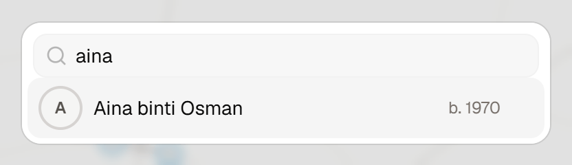

## 6. The tree

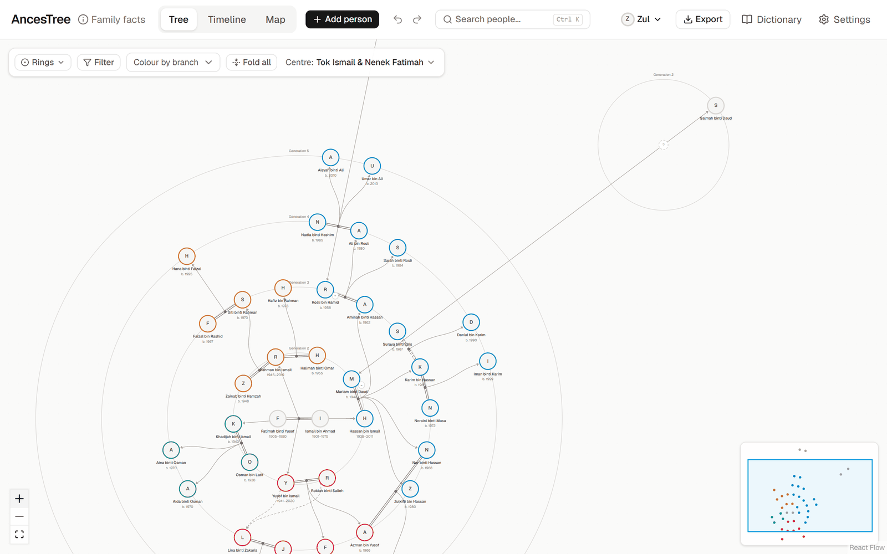

The tree starts with the family's oldest ancestor at the centre. Each ring around them is a generation: their children on the next ring, their grandchildren on the next, and so on. Each person is a circle with their photo, or their first letter, and their name and years underneath.

**Moving around:**

| To | Do this |
|---|---|
| Move the tree | Drag an empty part of it. |
| Zoom in or out | Turn the mouse wheel, or pinch on a touchpad. Or click **+** and **−** at the bottom left. |
| See everyone again | Click the square button under **−**, or press **F**. |
| Open someone | Click them. |
| See more about someone | Point at them: a card shows their full name, years, age and birthplace. |

**The lines between people:**

- a solid line joins a child to a birth parent; a dashed line, to an adoptive or foster parent;
- a double line joins a married couple; it's dashed when they divorced;
- children hang from a small dot between their two parents.

**The tools along the top of the tree:**

- **Rings** (or the name of the layout you're using) changes how the tree is laid out.
- **Filter** shows only some of the family.
- **Colour by branch** chooses what the colours mean.
- **Fold all** and **Unfold all** hide and show families who married in.
- **Centre:** chooses which family is in the middle.

### Layouts

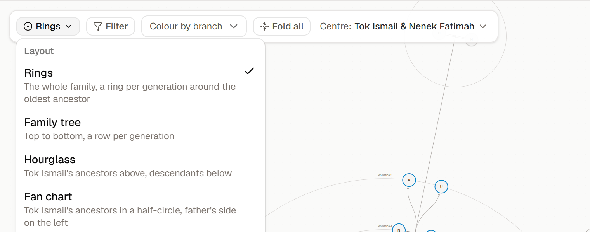

| Layout | What it shows |
|---|---|
| **Rings** | The whole family, a ring per generation around the oldest ancestor. |
| **Family tree** | Top to bottom, a row per generation. |
| **Hourglass** | Someone's ancestors above them, and their descendants below. |
| **Fan chart** | Someone's ancestors in a half-circle, their father's side on the left. |

For **Hourglass** and **Fan chart**, click someone on the tree to put them in the middle, and use **Generations −** and **+** to show more or fewer.

On the rings you can drag people to where you'd like them; AncesTree remembers. **Tidy up**, in the same menu, puts everyone back in their place.

### Showing only some of the family

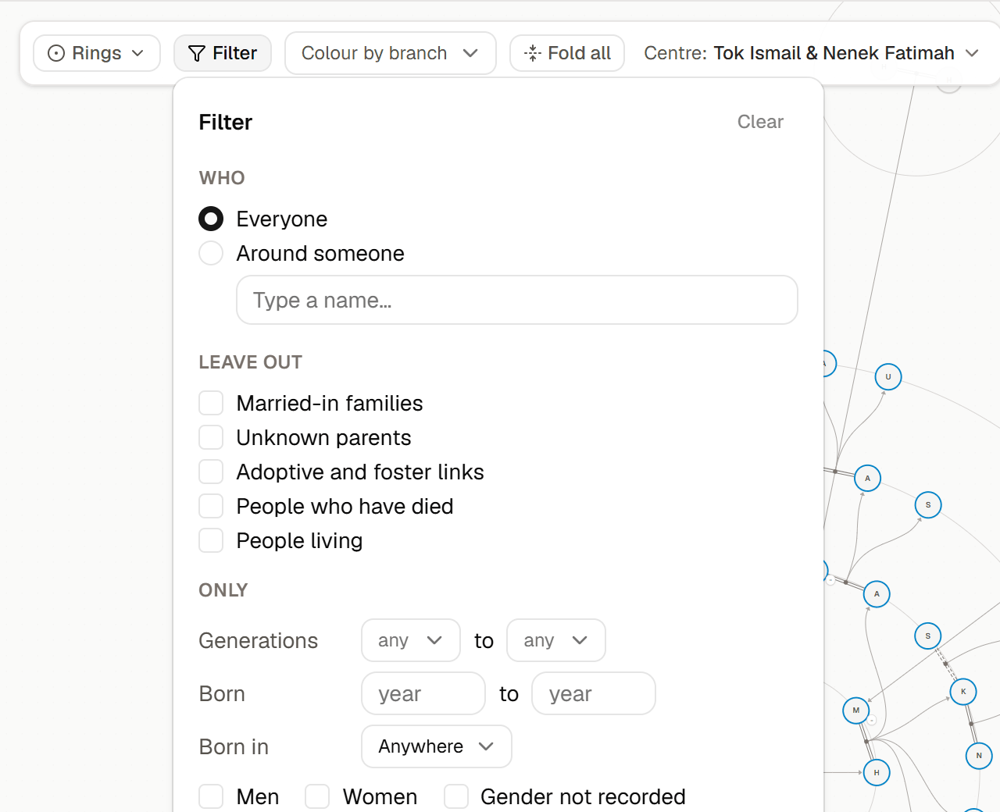

Click **Filter**, then choose:

- **Who**: **Everyone**, or **Around someone**: type a name, then choose their **Direct line**, **Ancestors**, **Descendants**, **Blood relatives** or those **Within a few links**;
- **Leave out**: families who married in, unknown parents, adoptive and foster links, people who have died, or people living;
- **Only**: some generations, people born between two years or in one place, men or women, or those missing a birth year or a photo;
- **The others**: **Hidden**, or **Faded** to keep them in view but pale.

What you choose shows as small labels under the tools. Click **×** on a label to take it away, or **Clear all**. The filter also applies to the timeline and the map.

### Families and the centre

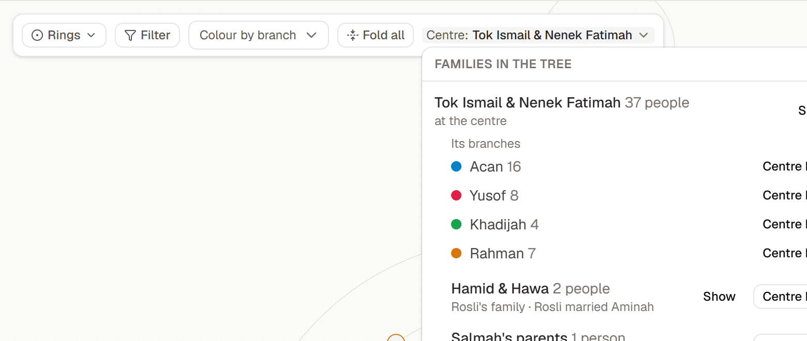

Click **Centre:** to see the families in the tree: the main one, its branches, and the families who married in. Click **Centre here** to put one in the middle, or **Show** to light it up. **Use the oldest ancestor** puts the tree back as it was.

### Colours

- **Colour by branch**: each child of the oldest ancestors, and their descendants, get a colour of their own.
- **Colour by generation**: a colour per generation.
- **Colour by closeness to me**: how closely each person is related to you. This needs [Me](#11-me-telling-ancestree-who-you-are).
- **No colours**.

## 7. Looking at someone

Click someone on the tree. Their panel opens beside the tree.

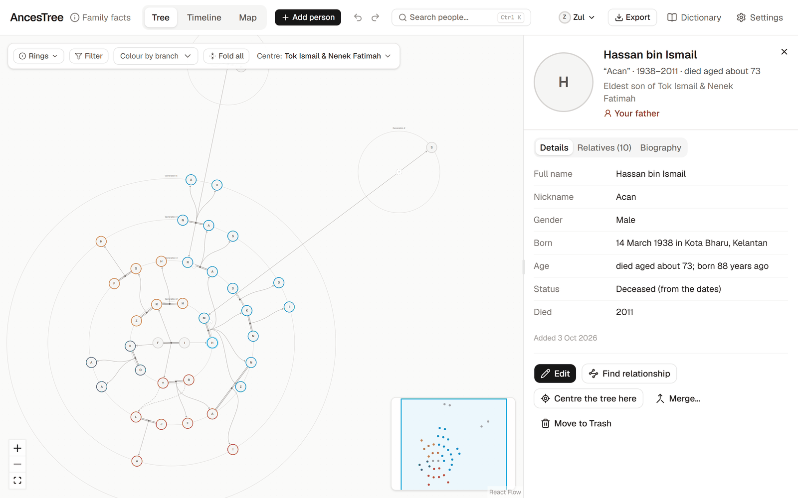

At the top: their name, nickname, years and age, which child they are (for example "Eldest son of…"), and, once you've chosen [Me](#11-me-telling-ancestree-who-you-are), what they are to you, such as **Your father**.

The panel has three tabs:

- **Details**: everything recorded about them, such as when and where they were born, where they live, and their occupation. Below it, **Who changed this** lists the latest changes to them, and which computer they came from.
- **Relatives**: their parents, husband or wife, brothers and sisters, and children.
- **Biography**: their life story (see [Life stories](#9-life-stories)).

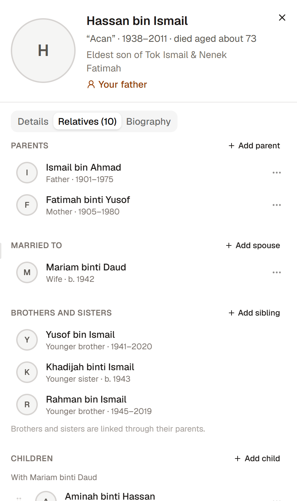

The buttons at the bottom of **Details**:

| Button | What it does |
|---|---|
| **Edit** | Change their details. |
| **Find relationship** | How is someone else related to them? (see [How are two people related?](#10-how-are-two-people-related)) |
| **Centre the tree here** | Puts them at the middle of the tree. **Undo centre** puts it back. |
| **Merge…** | For someone entered twice (see [Merge](#someone-entered-twice)). |
| **Move to Trash** | Takes them out of the tree, for 30 days (see [Removing someone](#removing-someone)). |

To close the panel, click **×** at its top right.

## 8. Adding and changing people

On a relative's computer, what you add and change waits for your keeper, who looks at it before it reaches the rest of the family. It shows on your computer straight away. See [Your changes](#your-changes). If your keeper let your computer in as a **Viewer**, nothing can be changed on it.

### Adding someone new

1. Click **Add person** in the top bar.
2. Type their **Full name**. It's the only thing you must fill in.
3. Fill in anything else you know (see [The details](#the-details) below).
4. Click **Add person** at the bottom.

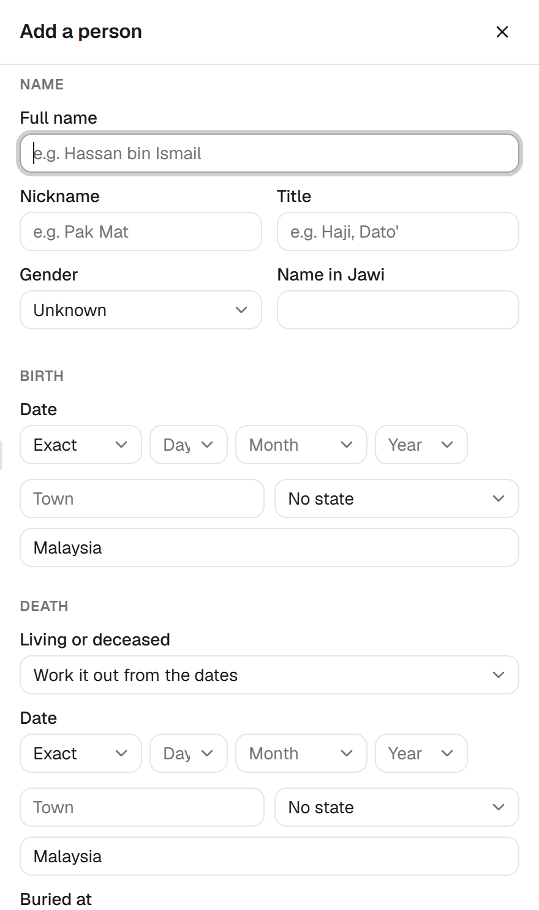

They appear on the tree, not yet linked to anyone. To link them, see [Adding a relative](#adding-a-relative) and [Linking two people](#linking-two-people-already-in-the-tree).

### Changing someone's details

1. Click them on the tree.
2. Click **Edit**.
3. Change what you need.
4. Click **Save**. Or **Cancel** to leave everything as it was.

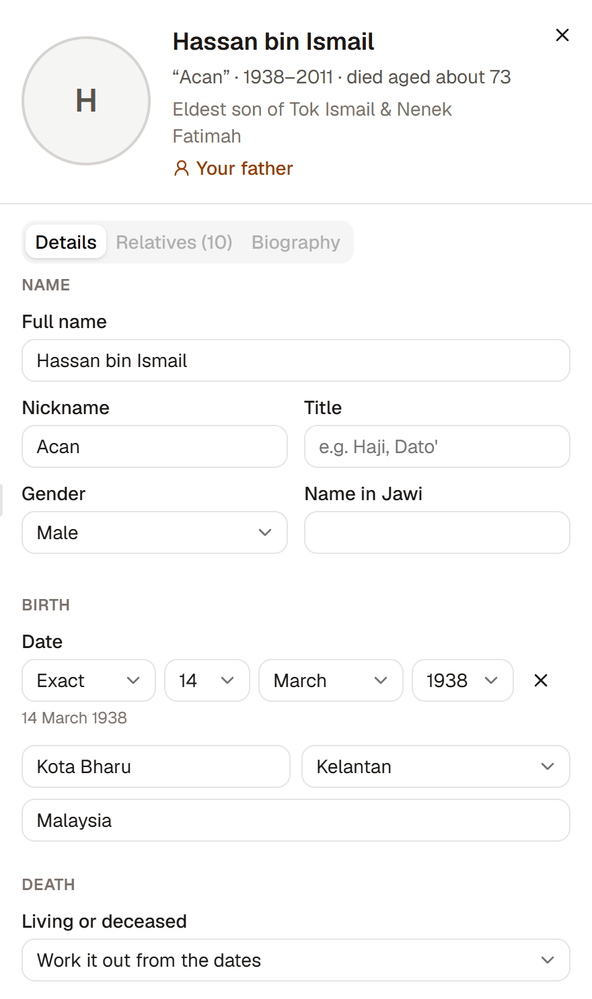

### The details

- **Name**: their **Full name**, **Nickname** (for example *Pak Mat*), **Title** (for example *Haji* or *Dato'*), **Gender**, and **Name in Jawi**.
- **Birth**: the **Date**, and the place: town, state and country.
- **Death**: **Living or deceased**, the date and place, and where they're **Buried at**. Leave **Living or deceased** on **Work it out from the dates** if you're not sure.
- **Now**: where they live, and their **Occupation**.
- **Notes**: a few short notes. Write longer things in their [life story](#9-life-stories).

**Dates.** First choose how sure the date is: **Exact**, **About**, **Before**, **After** or **Between**. Then pick the day, month and year from the lists. A year alone is enough. While a list is open, typing jumps to it: type "19" then "38" for 1938, or "feb" for February. The **×** clears the date.

**Places.** Type the town, choose the state, and check the country, which starts as Malaysia. The [map](#13-the-map) uses these.

### Adding a relative

1. Click the person on the tree, then the **Relatives** tab.
2. Click **+** beside **Parents**, **Married to**, **Brothers and sisters** or **Children**.
3. Choose **Someone new**, and type their name and anything else you know. Or choose **Already in the tree**, and find them by name.
4. Click **Add** (or **Link**).

A new brother or sister shares the parents already recorded. If none are recorded, an "unknown parent" joins them for now, shown as **?** on the tree. Click the **?** later to fill them in.

### Linking two people already in the tree

1. Point at the first person on the tree. A small blue arrow appears at their edge.
2. Drag the arrow onto the second person.
3. Choose what the first person is to the second: for example **Father**, **Daughter**, **Wife** or **Brother**. **More…** shows other kinds, such as an adoptive father.

To change or remove a link, click the line between the two people, or use the **…** button beside a relative in the **Relatives** tab. There you can change the kind of link (for example to adoptive), change a marriage to **Divorced** or **Widowed**, or click **Remove link**. Removing a link keeps both people.

### Birth order

AncesTree works out who's eldest from their dates of birth. When it can't be sure, the **Relatives** tab says so: drag the children into order, eldest first, by the handle beside each name.

### Photos

1. Click the person on the tree.
2. Click the circle at the top of their panel.
3. Click **Choose a photo…**, and choose a photo from your computer.
4. Drag the photo and use **Zoom** to fit their face in the circle.
5. Click **Save photo**.

Photos can be JPEG, PNG, WebP, HEIC, GIF, BMP or TIFF, up to 20 MB. To crop it again later, click the circle and **Adjust crop**. **Remove** takes the photo off.

### Removing someone

1. Click them on the tree, then **Move to Trash**.
2. Click **Move to Trash** again to confirm.

Their links go with them. Everything can be brought back, photo included, for 30 days: click **Undo** at once, or open **Settings → Trash** and click **Restore** beside them.

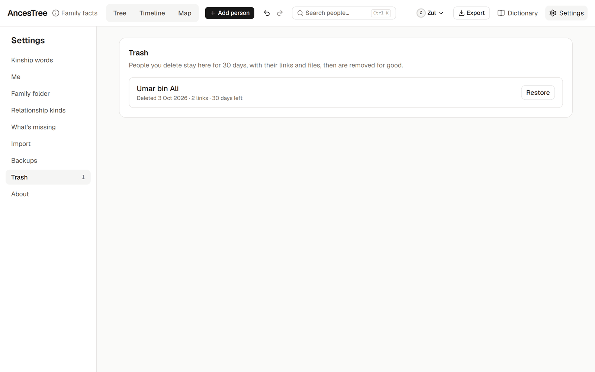

### Kinds of parent link

**For the keeper.** A child's link to a parent can be by birth, or another kind: adoptive, foster, or one you add, such as guardian. Only birth links count as blood, for the tree's lineage and the relationship finder.

Open **Settings → Relationship kinds** to see them. **Add kind** adds one, with what the parent and the child are called, in English and, if you like, Malay and Javanese. **Offered** chooses which kinds are offered when linking; **In the tree** chooses whether such children sit under that parent on the tree.

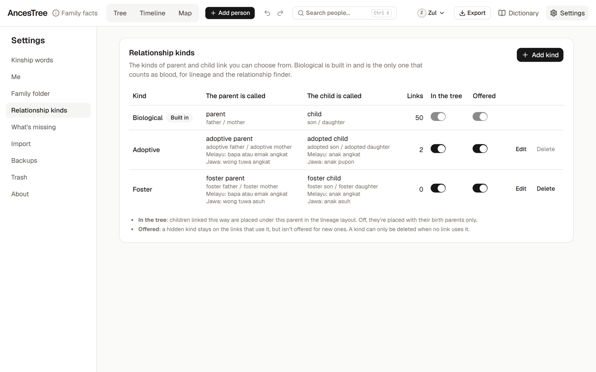

### Someone entered twice

If the same person is in the tree twice:

1. Click the one you want to keep, then **Merge…**.
2. Type the other one's name, and choose them.
3. Check what will happen: the details and links that move across.
4. Click **Merge … into …** to confirm.

The one you kept takes the other's details where they have none, and all of their links. The other goes to the Trash. **Undo** puts them back as two.

## 9. Life stories

Each person can have a life story, with pictures and sources.

1. Click the person on the tree, then the **Biography** tab.
2. Write their story. It saves itself as you type; it says **Saved ✓** when it has.

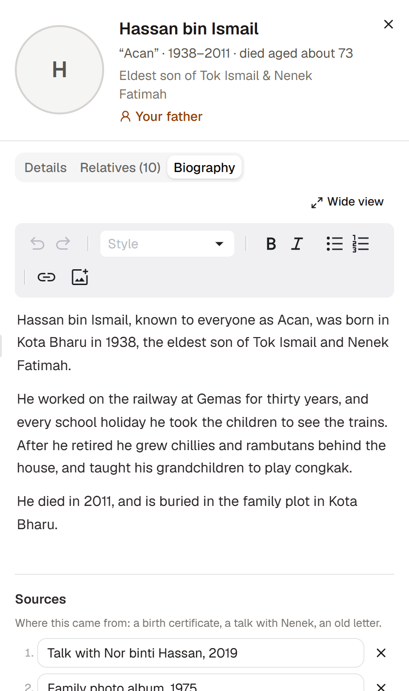

- **Wide view** opens a big page for writing. **Back to the panel** returns.
- The buttons above the story make text **bold** or *italic*, add headings, lists and links.
- **Add a picture** puts a photo inside the story, with a caption. You can also drag a picture into the story.
- Under the story, **Sources** lists where it came from: "Birth certificate, 1938", or "A talk with Nenek". Click **Add a source** for each.

## 10. How are two people related?

1. Click the first person on the tree, then **Find relationship**.
2. A yellow bar asks you to click anyone. Click the second person on the tree. Or press **Ctrl+K** and search for them.

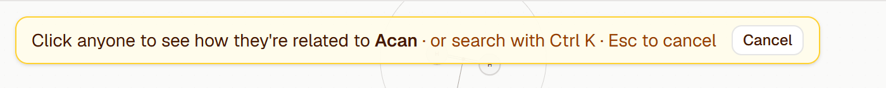

The answer appears in the panel, and the path between them lights up on the tree.

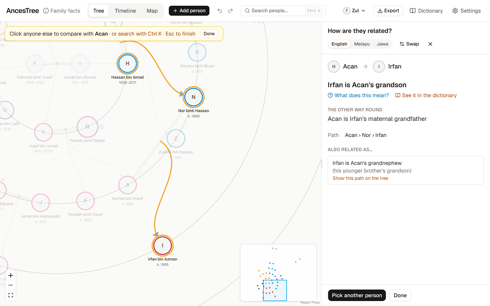

- **English**, **Melayu** and **Jawa** switch the language of the answer.
- **What does this mean?** explains it, for example by their shared grandparents.
- **The other way round** gives the answer from the second person's side.
- **Also related as…** shows other ways they're related, if there are any.
- **Swap** swaps the two people. **Pick another person** compares the first person with someone else. **Done** finishes.

## 11. Me: telling AncesTree who you are

Tell AncesTree which person in the family you are. Every panel then says what each person is to you, like "your pak long", and the tree can colour everyone by how close they are to you.

1. Click **Me** in the top bar.
2. Type your name, and click yourself in the list.

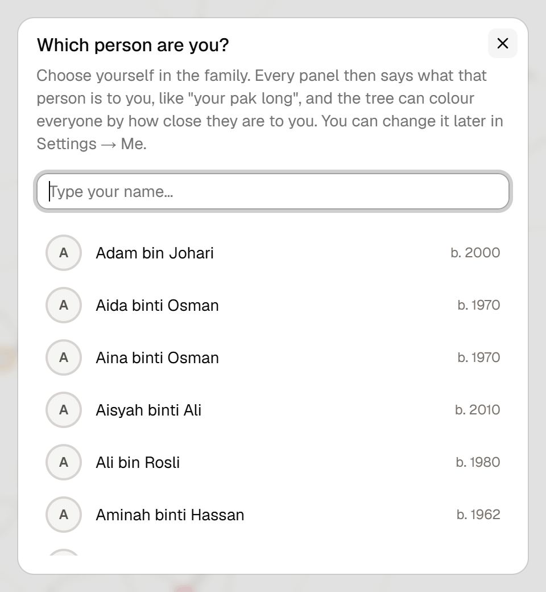

Once you've chosen, the **Me** button shows your name. Click it for these choices:

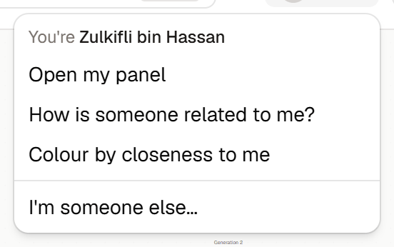

- **Open my panel**;
- **How is someone related to me?**;
- **Colour by closeness to me**;
- **I'm someone else…**, to choose again.

Each computer keeps its own choice. **Settings → Me** also has **Forget who I am**.

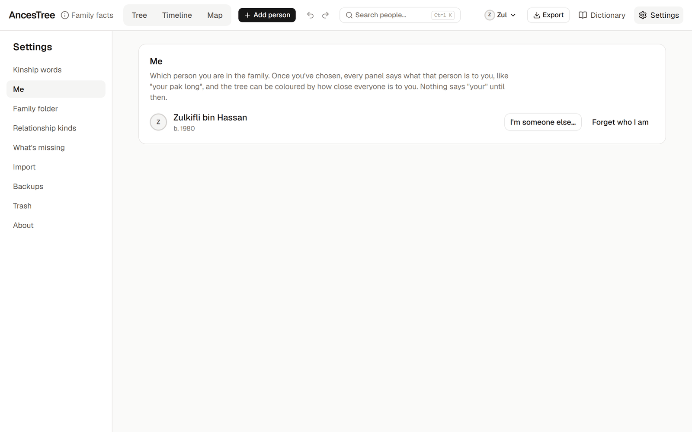

## 12. The timeline

Click **Timeline** in the top bar. Everyone appears along the years, with a bar across their life.

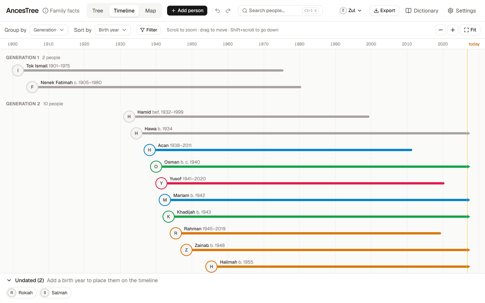

- **Group by** puts people in rows by **Generation** or **Branch**. **Sort by** orders them.
- Turn the mouse wheel to zoom in and out on the years. Drag to move along them. Hold **Shift** and turn the wheel to move down.
- **Fit** shows all the years again.
- A bar ending in an arrow is someone living. A bar that fades out is someone whose death isn't recorded.
- People with no birth year wait at the bottom, under **Undated**. Add their year of birth to place them.

## 13. The map

Click **Map** in the top bar. It shows where the family lives, or where they were born.

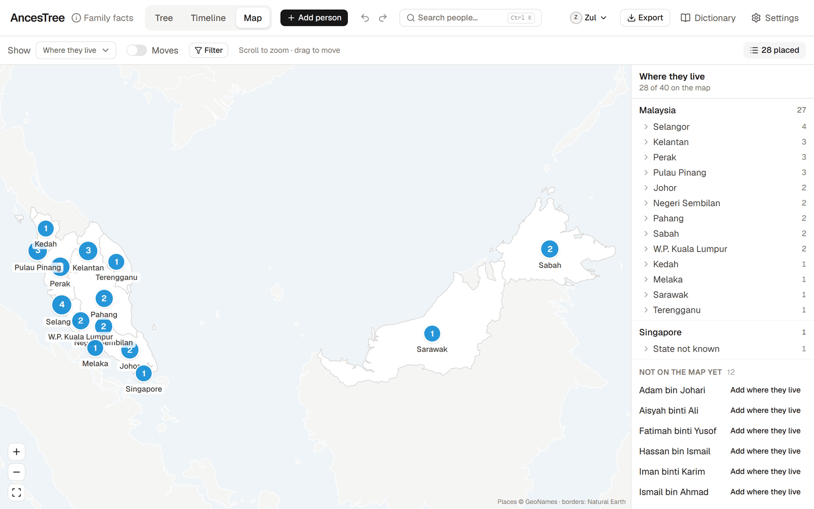

- **Show** chooses **Where they live** or **Where they were born**.
- **Moves** draws a line from where each person was born to where they live.
- Turn the mouse wheel to zoom. Each circle shows how many people are there. Click a circle to zoom in; close up, you see each person's photo in their town.
- The list on the right counts people by country, state and town. Click a name to see them on the map.
- **Not on the map yet** lists those with no place recorded. Click **Add where they live** to fill it in there and then.

**A town the map doesn't know** is placed at the middle of its state or country, under **Placed roughly**. Click **Put it on the map**, then click the right spot on the map.

The map needs no internet: its towns and borders come with AncesTree.

## 14. Family facts, and what's missing

**Family facts** shows the whole family at a glance: how many people and generations, the oldest and youngest, the longest life, the biggest family, the most common names, birthdays and remembrance days this month, and what's still to fill in. Click **Family facts** at the top left. Click a name to open their panel.

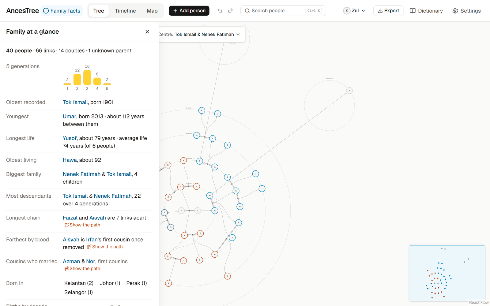

**What's missing** lists what the family's record doesn't say yet, with a quick way to fill in each: genders, dates of birth, birth order, unknown parents, photos, where people live, and people not linked to anyone. Open **Settings → What's missing**. Every fix can be undone.

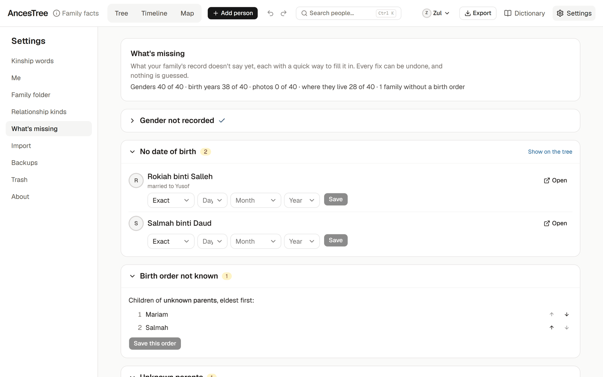

## 15. Kinship words and the dictionary

AncesTree knows the words for relatives in three languages: English, Bahasa Melayu and Basa Jawa.

- **To choose the language** of the words, open **Settings → Kinship words**, and choose **English**, **Bahasa Melayu** or **Basa Jawa**. The rest of AncesTree stays in English.
- **Malay birth-order titles**: in the same place, the titles your family uses for uncles and aunts by birth order, such as *Long*, *Ngah* and *Lang*, and *Su* for the youngest. Change them if your family says them differently, then click **Save titles**. In a family folder, the keeper sets them for everyone: on a relative's computer they're shown, not changed.

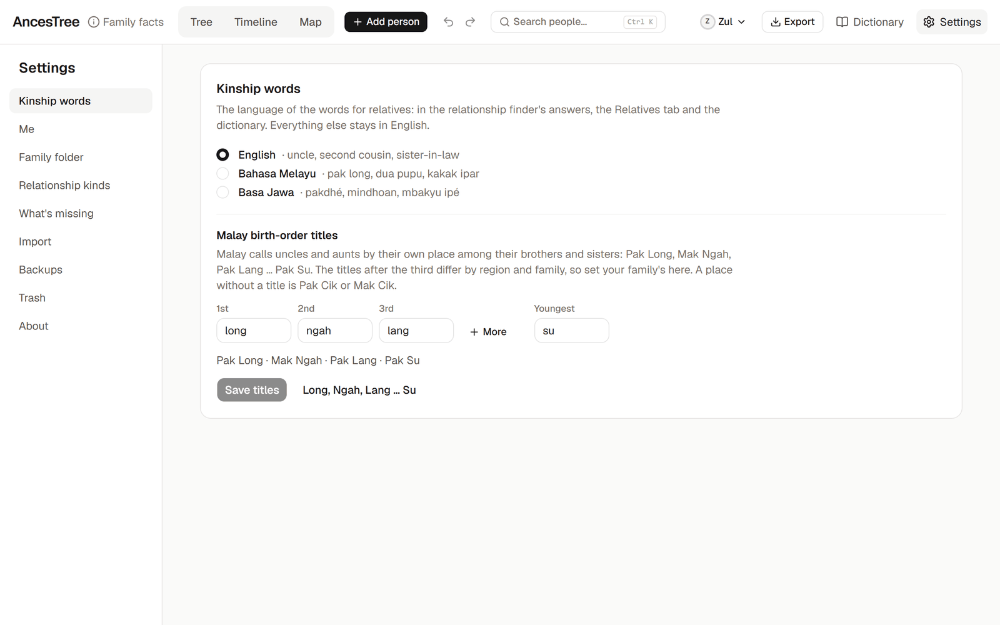

**The Dictionary**, in the top bar, lists every word AncesTree uses for a relative in the three languages, with other words people say. Type in **Search words or relations…** to find one.

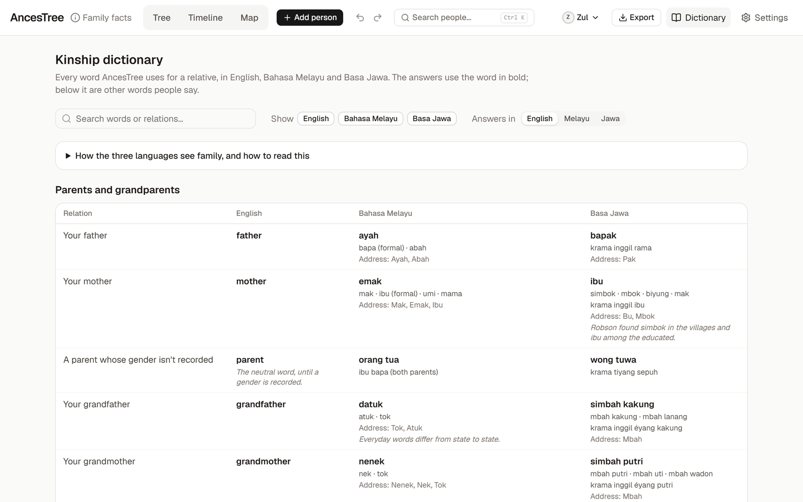

## 16. Copies for phones, and other files

Click **Export** in the top bar.

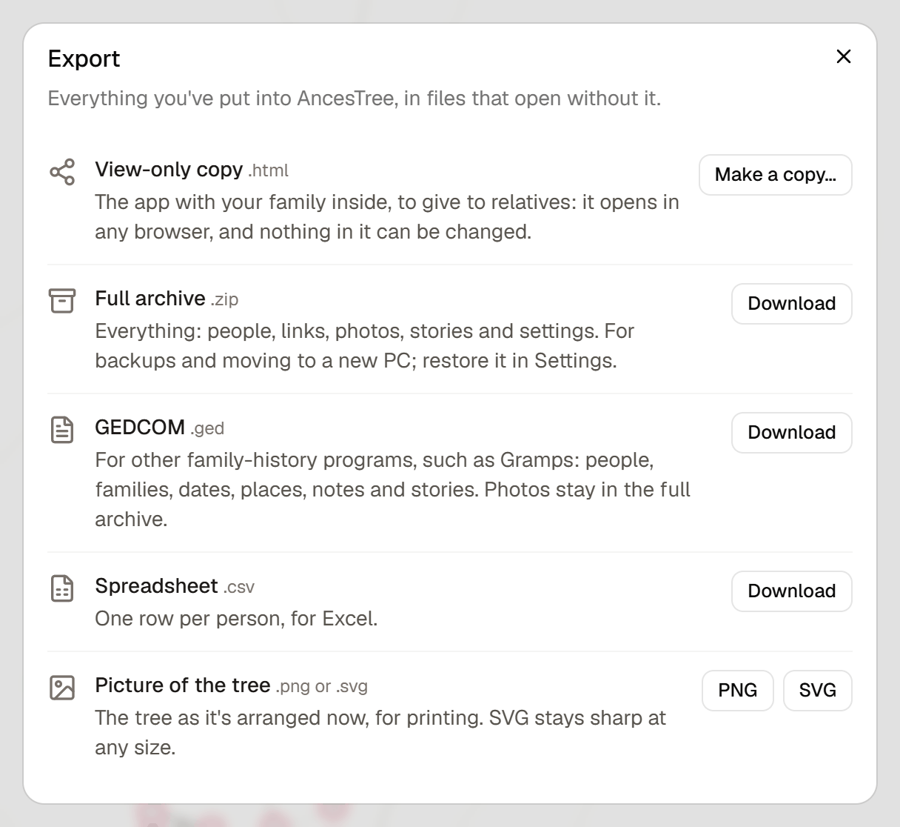

| Choice | What you get |
|---|---|
| **View-only copy** | The whole family in one file, to give to relatives on phones, tablets or computers without AncesTree. It opens in any web browser, and nothing in it can be changed. |
| **Full archive** | Everything: people, links, photos, stories and settings. For moving to another computer. |
| **GEDCOM** | A file for other family-history programs, such as Gramps. |
| **Spreadsheet** | One row per person, for Excel. |
| **Picture of the tree** | The tree as it looks now, to print. **PNG** is a picture; **SVG** stays sharp at any size. |

Files go to your **Downloads** folder.

### A copy for phones

1. Click **Export**, then **Make a copy…** beside **View-only copy**.
2. Give it a **Title**, such as the family's name.
3. For copies that go beyond close family, choose **Hide their details** under **Living people**. Living people's day and month of birth, places, notes and life stories are then left out.
4. If you like, tick **Lock the copy with a password**, and type one. Tell them the password by phone, not with the file.
5. Click **Make the copy**.

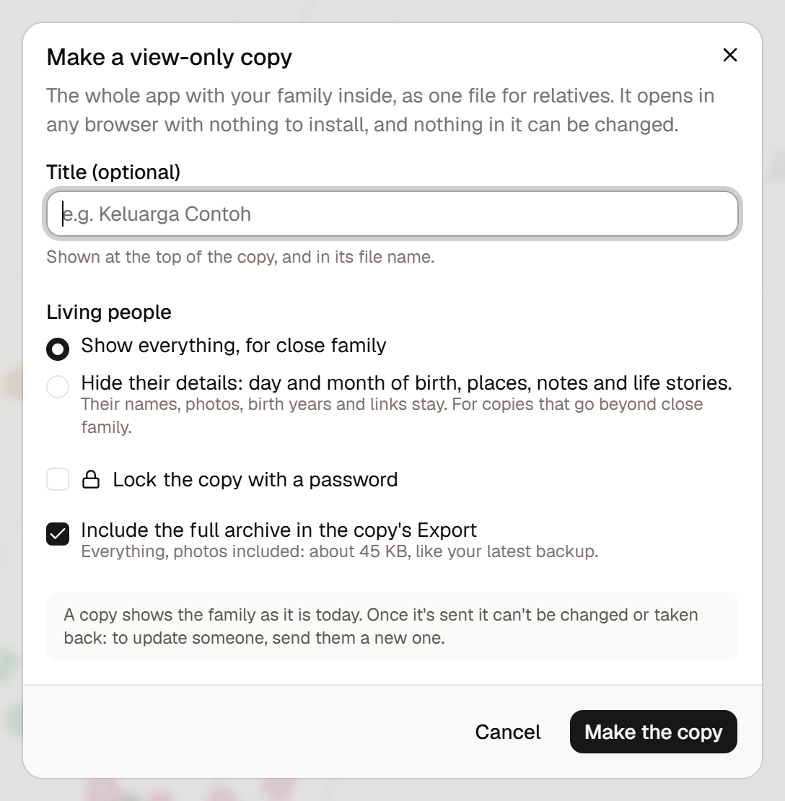

Send the file by WhatsApp, email or a USB stick. On an Android phone, open it with Chrome. iPhones and iPads can't open it: they show the file without running it.

A copy is the family as it is today. It never changes; to update someone, send them a new copy.

## 17. Bringing people in from a spreadsheet

**Mostly for the keeper.** People can come in from an Excel spreadsheet: a branch a cousin typed up, or corrections.

1. Open **Settings → Import**.
2. Click **Template (.csv)** to get an empty spreadsheet with the right columns. **Example (.csv)** is the same, filled in with the made-up family.
3. Fill it in with Excel, one row per person. Only **Full name** is needed. Save it as **CSV UTF-8**.
4. Click **Choose a file…**, and choose it.
5. AncesTree shows every change it would make, each with a tick. Untick what you don't want, and answer any questions under **To check**.
6. Click **Import … changes**.

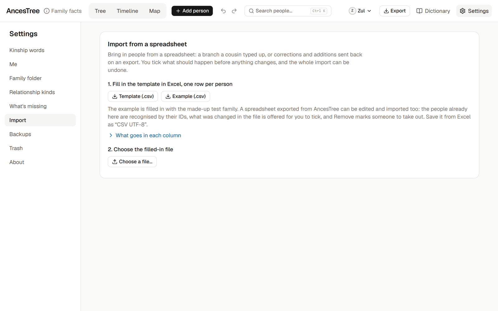

AncesTree makes a backup first. **Undo** takes the whole import back. Later, **Take back…** under **Earlier imports** does the same.

---

# Part 3: The family folder

The family folder keeps every family computer in step, through a private folder in the keeper's Google Drive:

- the keeper's changes reach every relative's computer by themselves, photos and stories too;
- a relative's changes go to the keeper, who looks at each before it reaches everyone else;
- everything in Google Drive is locked on the family's computers first. Google keeps the files, but can't read them.

AncesTree must be running for this to happen. It runs by the clock, so leave it there.

**Signing in to Google** happens the same way for relatives and the keeper:

1. Open **Settings → Family folder**, and click **Sign in with Google**. Google's page opens in your web browser.

   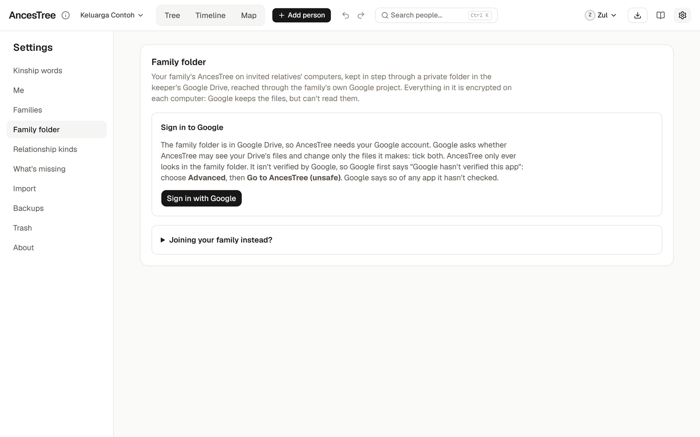

2. **Choose your Google account.** A relative chooses the account their keeper invited.
3. **Google says "Google hasn't verified this app".** Google says this of any app it hasn't checked, and AncesTree is made for one family. Click **Advanced**, then **Go to AncesTree (unsafe)**.
   <!-- picture: guide/google-1-not-verified.png (Google hasn't verified this app) -->
   <!-- picture: guide/google-2-advanced.png (the same after Advanced, with Go to AncesTree (unsafe)) -->
4. **Google asks what AncesTree may do.** Tick **both** boxes, then click **Continue**:
   - seeing your Google Drive's files, so that AncesTree can find the family folder;
   - changing only the files AncesTree itself makes.

   AncesTree only ever looks in the family's folder, and in a small folder it makes for what a relative sends the keeper.
   <!-- picture: guide/google-3-access.png (what AncesTree may do, both boxes ticked) -->
5. **The page says "Done. You can close this tab and go back to AncesTree."** Close the tab, and go back to AncesTree.
   <!-- picture: guide/google-4-done.png (Done. You can close this tab) -->

## 18. For relatives: join your family

Ask your keeper to invite your Google account first. Google doesn't tell you when they have, so they'll tell you.

### Join

1. Install AncesTree (see [Install AncesTree](#2-install-ancestree)).
2. AncesTree says **"Welcome to AncesTree"**. Click **Join or start**. Or open **Settings → Family folder**.
   <!-- picture: guide/relative-1-welcome.png (the welcome bar, with Join or start) -->
3. Sign in to Google, as above, with the account your keeper invited.
4. Under **Join your family's AncesTree**, type a name for this computer, such as *Aisyah's laptop*. The family sees this name.
5. Click **Ask to join**.
   <!-- picture: guide/relative-2-join.png (Join your family's AncesTree) -->
6. AncesTree shows **Waiting to be let in**, with a code of eight letters and numbers. **Read the code to your keeper**, by phone or message. They let your computer in only if they see the same code.
   <!-- picture: guide/relative-3-code.png (Waiting to be let in, with the code) -->
7. Once your keeper lets you in, **the family arrives by itself**, photos and stories too. Leave AncesTree running: with many photos, it can take a while. Meanwhile it says "Photos and stories are still arriving".

If you had already put people into AncesTree yourself, the family replaces them on this computer. What you had is kept in a backup, under **Settings → Backups**: send it to your keeper if it should join the family.

### What your computer may do

Your keeper chooses one of these when letting your computer in:

| Role | What it means |
|---|---|
| **Contributor** | You change the family as you like. Each change waits for your keeper, who looks at it first. |
| **Trusted** | Your changes come in by themselves, unless they clash with your keeper's or take something out. |
| **Viewer** | You see the whole family, but can't change it on this computer. |

Some things are the keeper's alone, whatever your role: the kinds of relationship, the map's hand-placed pins, importing spreadsheets, and restoring a backup.

### Your changes

When you change something, the bar at the top says how many of your changes wait for your keeper. AncesTree sends them by itself within a minute. **Send now** sends them at once.

<!-- picture: guide/relative-4-changes-waiting.png (the bar, with Send now) -->

Your keeper sees them the next time their AncesTree is running. When they bring your changes in, those reach every computer in the family, yours too.

### Your keeper's answer

When your keeper leaves something out, or writes you a note, **Settings** shows a number, and **Settings → Family folder** shows **The keeper's answer**: their note, and what wasn't taken. What wasn't taken goes from your computer. Click **Got it** when you've read it.

<!-- picture: guide/relative-5-answer.png (The keeper's answer) -->

### Leaving the family

1. Ask your keeper to remove your computer.
2. On your computer, open **Settings → Family folder**, click **Leave the family folder…**, then **Leave**.

The family stays on your computer as it is, as your own: nothing new arrives, and nothing you change goes to the keeper. You can ask to join again later.

**Asked to join the wrong family, or your keeper turned your computer away by mistake?** Click **Leave the family folder…** under **Waiting to be let in**, then ask to join again.

## 19. For the keeper: start and look after the family folder

**For the keeper.** You start the family's folder once, in your Google Drive, then let each relative's computer in.

**Before you start:**

- **Bring your family in first.** If your family is in another AncesTree, move it across first (see [Moving the family to another computer](#moving-the-family-to-another-computer)). Starting the family folder sends your family as it is.
- **Choose the Google account carefully.** The family folder lives in its Drive. You'll need this same account to be the keeper again on another computer.
- **Keep a pen and paper, or a printer, ready** for your recovery code.

### Start the family folder

1. Sign in to Google, as above, with your account.
2. Under **Start your family's folder, as its keeper**, type the family's name, such as *Keluarga Rahman*, and this computer's name, such as *Home PC*.
3. Click **Start the family folder**.
   <!-- picture: guide/keeper-1-start.png (Start your family's folder, as its keeper) -->
4. **AncesTree shows your recovery code.** With it, and this Google account, you can be the family's keeper again on another computer. Without it, no one can.
   - Click **Print**, or write the code down. Keep it somewhere safe, away from this computer: with your important papers, or in your password manager.
   - When it's safe, click **I've kept it safe**. AncesTree shows the code until you do, then never again.
   <!-- picture: guide/keeper-2-recovery-code.png (Your recovery code; the code covered) -->

A Google account's Drive holds one family folder: AncesTree won't start a second.

**Lost your recovery code, or someone else may have seen it?** In **Settings → Family folder**, click **Lost your recovery code?**, then **Make a new recovery code**, and **Make it**. Keep the new code as you kept the old. Once it's in your Google Drive, the old code opens nothing.

### Invite a relative

1. Under **Invite a relative, by their Google account**, type their Google address, and click **Invite**.
   <!-- picture: guide/keeper-3-invite.png (Invite a relative) -->
2. **Tell them yourself:** Google doesn't send them anything. Send them this guide, and ask them to follow [Join your family](#18-for-relatives-join-your-family).

### Let their computer in

When a relative asks to join, **Settings** shows a number, and **Settings → Family folder** shows their computer under **Asking to join**, with a code.

<!-- picture: guide/keeper-4-asking-to-join.png (Asking to join, with the code and the roles) -->

1. **Call or message them**, and ask them to read you the code on their screen.
2. **Let them in only if it's the same code.** If it isn't, click **Not this one**, and find out why. If you turned them away by mistake, they leave and ask to join again (see [Leaving the family](#leaving-the-family)).
3. **Choose what their computer may do:** **Trusted**, **Contributor** or **Viewer** (see [What your computer may do](#what-your-computer-may-do)). Contributor is a good start: you look at each change first.
4. Click **Let in**.

The family reaches their computer within a few minutes, photos and stories too.

### Changes waiting

When a relative changes something, it waits for you, and **Settings** shows a number.

1. Open **Settings → Family folder**. Under **Changes waiting**, click **Review** beside their computer.
   <!-- picture: guide/keeper-5-changes-waiting.png (Changes waiting, with Review) -->
2. Each change has a tick. Untick what you don't want.
   - A change that clashes with one of yours, or that takes something out, waits for its own tick.
   - Under **To check**, AncesTree asks whether someone new is someone already in the family.
3. Write a note, if you like. It goes back to them with whatever you don't take.
4. Click **Bring in … changes**. Or **Take none**, to send everything back with your note. **Not now** leaves it for later.
   <!-- picture: guide/keeper-6-review.png (the review: changes, ticks, note, Bring in) -->

If what they sent can't be read on your computer, the review says so: click **Take none**. They hear that none of it was taken, and can make their changes again.

Before anything comes in, AncesTree makes a backup. **Undo** takes back the people, details and links. **Settings → Import** keeps each bringing-in under **Earlier imports**; its **Take back…** undoes all of it, life stories and photos too. What you bring in reaches every computer in the family.

A **Trusted** computer's changes come in by themselves, unless they clash with yours, take something out, or need an answer under **To check**.

### Remove a computer

Under **The family's computers**, click **Remove** beside it, then **Remove** again. AncesTree stops sharing the family folder with that Google account, and gives the family a new key. That computer keeps what it already has, but can't read anything new.

<!-- picture: guide/keeper-7-computers.png (The family's computers, with Remove) -->

### Be the keeper on a new computer

1. Install AncesTree on the new computer.
2. Open **Settings → Family folder**, and sign in with the Google account that started the family folder.
3. Click **The family's keeper, on a new computer?**, type your recovery code, and click **Be the keeper again**.

The family comes back from the family folder. If photos and stories are still arriving, AncesTree says so, and waits for them before it sends anything.

The old computer, if it still runs, stops keeping the family by itself: its **Settings → Family folder** says **Another computer keeps the family now**. Click **Leave the family folder…** there, then **Leave**, or [remove AncesTree](#25-removing-ancestree) from it.

### Copies for those without AncesTree

For relatives on phones or tablets, or anyone who won't install AncesTree, make a [view-only copy](#a-copy-for-phones).

---

# Part 4: Look after AncesTree

## 20. Backups

A backup holds everything: people, links, photos, stories and settings. **AncesTree makes one each day by itself** while it runs, and keeps the last 30. Backups you make yourself are kept until you delete them.

Open **Settings → Backups** to see them all.

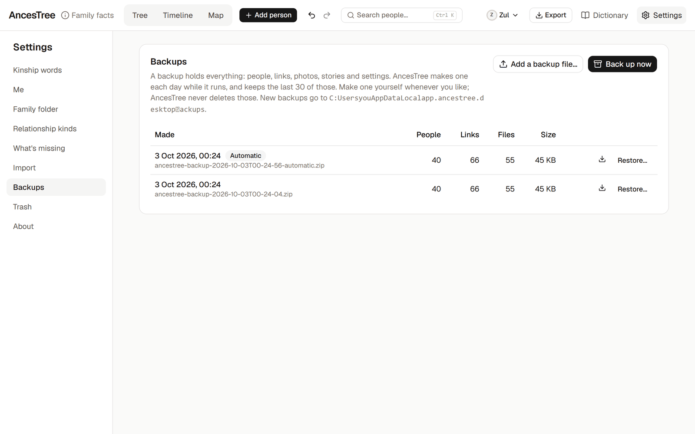

| To | Do this |
|---|---|
| Make a backup now | Click **Back up now**. |
| Copy a backup somewhere safe | Click the download arrow beside it. It goes to your **Downloads** folder; copy it to a USB stick or another disk now and then. |
| Bring in a backup from elsewhere | Click **Add a backup file…**, and choose the file. |
| Go back to a backup | Click **Restore…** beside it, then **Replace everything**. |

**Restoring replaces everything** in AncesTree with what the backup holds. Everything as it is just before is backed up first, so you can always go back.

On a relative's computer, restoring is the keeper's alone: the family comes from the family folder.

### Moving the family to another computer

- **The keeper, with a family folder:** see [Be the keeper on a new computer](#be-the-keeper-on-a-new-computer). The family comes from the family folder.
- **A relative:** install AncesTree on the new computer and [join](#18-for-relatives-join-your-family) again. Ask your keeper to remove your old computer.
- **Anyone without a family folder:**
  1. On the old computer, open **Settings → Backups**, click **Back up now**, then the download arrow beside the new backup. Copy the file to a USB stick.
  2. On the new computer, install AncesTree, open **Settings → Backups**, click **Add a backup file…**, and choose the file from the USB stick.
  3. Click **Restore…** beside it, then **Replace everything**.

## 21. Updates

AncesTree looks for a new version each time it starts, and once a day. When there's one, a bar at the top says **A new version of AncesTree is ready**. Click **Restart to update**. Or carry on: it updates itself the next time AncesTree starts.

<!-- picture: guide/update-ready.png (the bar: A new version of AncesTree is ready) -->

**What's new** in the same bar says what the new version brings.

To look for a new version yourself, right-click the icon by the clock and choose **Check for updates**. Or open **Settings → About** and click **Check for updates**.

<!-- picture: guide/desktop-settings-about.png (Settings → About in the installed AncesTree: version and Check for updates) -->

AncesTree installs only updates signed by its maintainer.

## 22. Keep your computer safe

The family folder in Google Drive is locked: only your family's computers can read it. On each computer, though, the family is kept as it is. Anyone who has your computer can read it, unless its disk is locked. Many new computers lock it already. To check, and to switch it on:

- **Windows 11 Home:** click **Start**, then **Settings → Privacy & security → Device encryption**, and switch it **On**. If it isn't there, your computer can't do it.
- **Windows 10 or 11 Pro:** click **Start**, type **Manage BitLocker**, open it, and click **Turn on BitLocker**.
- **Mac:** open **System Settings → Privacy & Security → FileVault**, and click **Turn On**.

When you switch it on, you're given a recovery key. Keep it as safely as the keeper's recovery code: without it, a forgotten password loses everything on the computer.

Give your computer a password too, so that no one else can sign in to it.

## 23. Where AncesTree keeps the family

AncesTree keeps everything in one folder:

| Your computer | The folder |
|---|---|
| Windows | `%LOCALAPPDATA%\app.ancestree.desktop` |
| Mac | `~/Library/Application Support/app.ancestree.desktop` |

To open it on Windows, copy its name into the address bar of File Explorer and press **Enter**. On a Mac, in Finder, choose **Go → Go to Folder…**, paste its name and press **Return**.

Inside it:

- `family`: the photos, life stories and settings;
- `backups`: the backups;
- `logs`: notes AncesTree keeps of what it did. If something goes wrong, your keeper may ask for this folder.

**Settings → About** shows where the folders are.

## 24. When something goes wrong

| What you see | What to do |
|---|---|
| **AncesTree needs the internet this once, to fetch its database** | Connect to the internet. AncesTree tries again by itself. |
| **AncesTree's engine stopped**, or **Can't reach the database** | Right-click the icon by the clock and choose **Quit AncesTree**. Then open AncesTree again. Nothing is lost: your family is safe on the disk. If it happens again, send your keeper the `logs` folder (see [Where AncesTree keeps the family](#23-where-ancestree-keeps-the-family)). |
| The window has gone | AncesTree is still running. Click its icon by the clock. On a Mac, you can also click AncesTree in the Dock. |
| No icon by the clock | On Windows, click the small **^** arrow beside the clock: the icon may be hidden there. If it isn't, AncesTree isn't running: open it from **Start** (Windows) or **Applications** (Mac). |
| **No family folder is shared with this Google account yet** | Check that you signed in with the account your keeper invited. If you did, ask your keeper to invite it, then click **look again**. |
| **Both boxes need ticking on Google's page** | Sign in again, and tick both boxes. |
| **The sign-in to Google has ended: sign in again** | Open **Settings → Family folder**, and click **Sign in with Google**. |
| **That was … This computer's family folder is with …** | You signed in with another Google account. Sign in again with the account it names. |
| **No internet just now** | Nothing to do: AncesTree tries again every minute. |
| **Photos and stories are still arriving** | Leave AncesTree running: the family comes when they have. |
| **The family folder isn't shared with this Google account any more** | Ask your keeper. |
| **This computer was removed from the family** | Your keeper removed it. What's on it stays, but nothing new arrives. |
| **This computer's part can't be opened here** | Its family folder was copied from another computer or another Windows user. Click **Leave the family folder…**, then **Leave**. Then ask to join again, or, as the keeper, be the keeper again with your recovery code. |
| **Another computer keeps the family now** (the keeper) | You became the keeper on another computer with your recovery code. Keep the family there. Click **Leave the family folder…** here, then **Leave**. |
| **The family folder can't be found in your Google Drive** (the keeper) | If the folder was deleted, take it out of the bin in Google Drive. |
| **That recovery code doesn't open this family folder** (the keeper) | Check the code, and that you signed in with the account that started the family folder. Spaces and capitals don't matter. If you made a new code since, only the new one works. |
| **There's an AncesTree family folder in this Google account's Drive already** (the keeper) | Your family folder is there. To keep it on this computer, click **The family's keeper, on a new computer?** and use your recovery code. |
| **What … sends you couldn't be fetched just now** (the keeper) | Nothing to do: the rest of the family is in step, and AncesTree tries again every minute. If it stays, tell whoever looks after AncesTree. |
| A photo won't go in | Photos can be up to 20 MB. Try a smaller copy. |
| Something else | Note what it says, and tell your keeper. |

## 25. Removing AncesTree

If you're leaving the family, first ask your keeper to remove your computer, and [leave the family folder](#leaving-the-family).

**On Windows:**

1. Click **Start**, then **Settings → Apps → Installed apps**.
2. Click **…** beside **AncesTree**, then **Uninstall**.
3. The uninstaller asks whether to **Delete the application data**:
   - leave it **unticked** to keep the family and its backups on this computer, for if you install AncesTree again;
   - tick it to remove them too.

<!-- picture: guide/windows-6-uninstall.png (the uninstaller, with Delete the application data) -->

The same box appears if you install a new version over an old one and choose to uninstall the old one first. Leave it unticked there.

**On a Mac:**

1. Right-click AncesTree's icon in the menu bar, and untick **Start when I sign in**.
2. Choose **Quit AncesTree**.
3. Drag AncesTree from **Applications** to the Bin.

The family stays in its folder (see [Where AncesTree keeps the family](#23-where-ancestree-keeps-the-family)) until you delete that folder too.

## 26. Linux

AncesTree also runs on Linux, on a 64-bit Intel or AMD computer. Everything in this guide is the same, except:

- **Installing:** download `AncesTree_<version>_amd64.AppImage` from the [latest release](https://github.com/khilfi/ancestree/releases/latest). Put it where it will stay, for example in a folder named `Applications` in your home folder: AncesTree starts itself from there when you sign in. Right-click it, choose **Properties**, and switch on **Executable as Program** (on older Linux, tick **Allow executing file as program**). Or, in a terminal: `chmod +x AncesTree_*_amd64.AppImage`. Then double-click it.
- **If nothing happens:** run it from a terminal. If it mentions FUSE, install it: `sudo apt install libfuse2t64` on Ubuntu 24.04 or newer, or `sudo apt install libfuse2` on Ubuntu 22.04.
- **The icon by the clock** is in the top bar or panel, if your desktop shows such icons. On GNOME, add the **AppIndicator** extension. Clicking the icon may only open its menu: choose **Open AncesTree**.
- **The folder** is `~/.local/share/app.ancestree.desktop`.
- **Locking the disk:** choose to encrypt the disk when you install Linux. Most kinds of Linux can't switch it on afterwards.
- **Removing AncesTree:** untick **Start when I sign in**, choose **Quit AncesTree**, and delete the AppImage.
